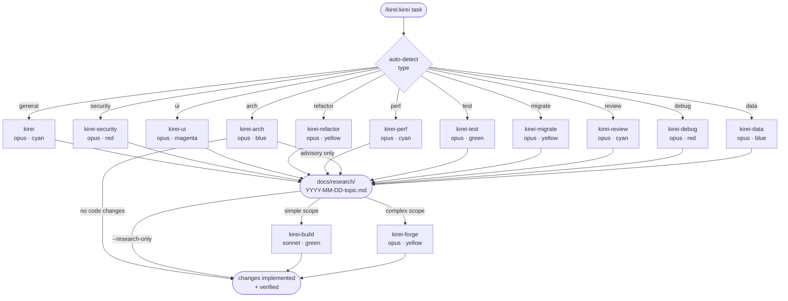
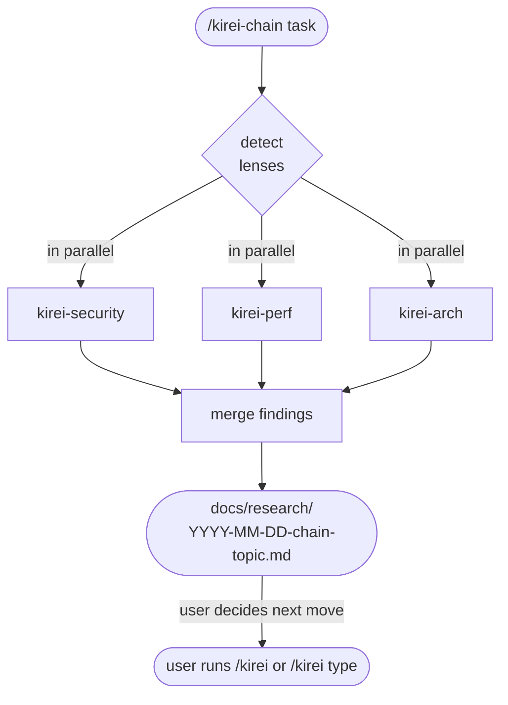
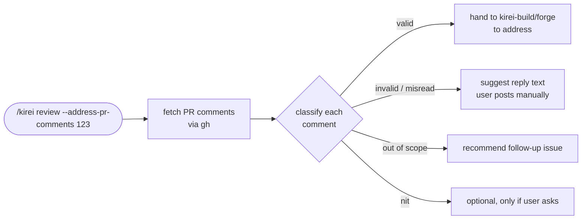

# kirei

A specialized agent team for Claude Code. Automated research → execute workflow with domain-specific specialists.

## Agents

### Research agents (analyse, prescribe, hand off)

| Agent | Model | Purpose |
|-------|-------|---------|
| `kirei` | opus | General research & investigation |
| `kirei-security` | opus | Security audit (OWASP, auth, injection) |
| `kirei-ui` | opus | UI/UX audit (impeccable skills integration) |
| `kirei-refactor` | opus | Code quality & refactoring plan |
| `kirei-perf` | opus | Performance bottleneck analysis |
| `kirei-arch` | opus | Architecture mapping + Mermaid diagram |
| `kirei-test` | opus | Test coverage gaps, missing edge cases, flake hunt |
| `kirei-migrate` | opus | Dependency / framework upgrade plan with breaking-change map |
| `kirei-review` | opus | Code review of pending changes or a GitHub PR; can also classify reviewer comments (`--address-pr-comments`) |
| `kirei-debug` | opus | Reproduce + root-cause a specific bug; may add tracked temp instrumentation |
| `kirei-data` | opus | Schema / migration safety / query / index audit |

### Execute agents (implement findings)

| Agent | Model | Purpose |
|-------|-------|---------|
| `kirei-build` | sonnet | Execute findings — normal/focused tasks |
| `kirei-forge` | opus | Execute findings — complex/multi-file tasks |

## Skills

| Skill | Purpose |
|---|---|
| `/kirei [task]` | Single-lens orchestrator — auto-detects type and complexity, spawns the right research agent, then the right execute agent. |
| `/kirei-chain [task]` | Multi-lens orchestrator — runs up to 4 research agents in parallel against the same target and merges their findings into one report. Research-only by design. |

### `/kirei` flags

| Flag | Effect |
|---|---|
| `--research-only` | Skip the execute step. Deliver findings + handoff only. |
| `--findings <path>` | Skip research. Use an existing findings doc and go straight to execute. |
| `--pr <N>` | Force `kirei-review` mode against GitHub PR #N. |
| `--address-pr-comments <N>` | `kirei-review` fetches PR comments, classifies each (valid / out-of-scope / invalid / nit / resolved), and only valid ones are handed to `kirei-build`/`forge`. Invalid ones come back with suggested replies the user can post. |

### `/kirei-chain` flags

| Flag | Effect |
|---|---|
| `--types <a,b,c>` | Pin the lens set explicitly (otherwise auto-detected). Valid: `security, ui, refactor, perf, arch, test, data, general`. Capped at 4. |

## How it works



1. `/kirei` auto-detects task type and complexity (build/forge)
2. Spawns the appropriate `kirei-*` research agent
3. Research agent investigates, validates findings with the user via AskUserQuestion, writes `docs/research/YYYY-MM-DD-topic.md` in the target repo, and produces a structured handoff
4. Spawns `kirei-build` (sonnet) or `kirei-forge` (opus) with the handoff (skipped if `--research-only`)
5. Execute agent implements and verifies

### Multi-lens (`/kirei-chain`)



Use when one question needs more than one perspective. Capped at 4 parallel agents. Research-only by design — the merged report points the user (or a follow-up `/kirei`) to the highest-leverage fixes.

### PR comment workflow (`kirei-review --address-pr-comments`)



The agent never pushes commits or posts comments — it produces a triage report; you decide what lands.

## Install

### As a Claude Code plugin (recommended)

Add the kirei marketplace, then install the plugin:

```
/plugin marketplace add Shironex/kirei
/plugin install kirei@kirei
/reload-plugins
```

Once installed, the skill is invoked as:
```
/kirei:kirei [task description]
```

### Manual install (global, standalone)

Agents and skill go directly into your global `~/.claude/` directories — no marketplace needed. Skill invokes as `/kirei`.

```bash
git clone https://github.com/Shironex/kirei.git
cp kirei/agents/*.md ~/.claude/agents/
cp kirei/skills/kirei/SKILL.md ~/.claude/skills/kirei.md
```

### Local development / testing

```bash
claude --plugin-dir ./kirei
```

### Updating

Plugin install:
```
/plugin marketplace update kirei
/reload-plugins
```

Manual install: pull latest and re-run the copy commands.

## Design decisions

- **Ref MCP for docs** — agents use `mcp__Ref__ref_*` for library documentation; falls back to WebSearch if unavailable. context7 is not used.
- **AskUserQuestion after investigation** — findings are validated with the user once analysis is complete, not before. Prevents scope conversations from slowing down clear tasks.
- **Findings persistence** — every investigation writes to `docs/research/` in the target repo so findings survive across sessions.
- **Two execute tiers** — kirei-build (sonnet) for focused changes, kirei-forge (opus) for complex multi-file work. Research agent recommends which; orchestrator skill decides.
- **Omniscribe integration** — all agents update omniscribe_status and omniscribe_tasks throughout so the UI stays in sync.
