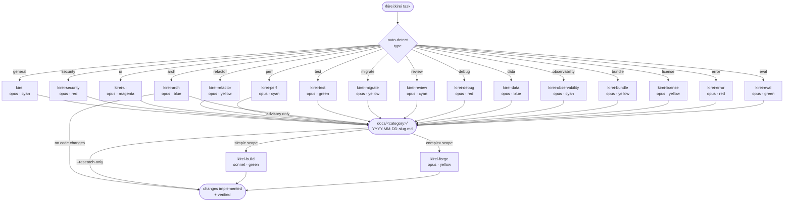
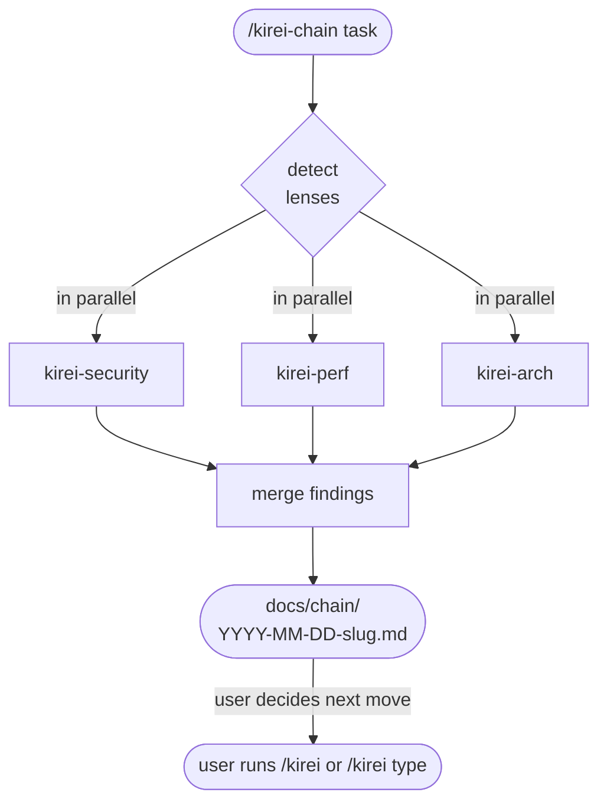
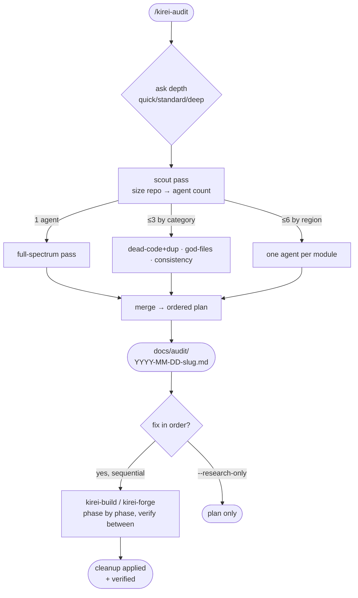

# kirei

A specialized agent team for Claude Code. Automated research → execute workflow with domain-specific specialists.

## Agents

### Research agents (analyse, prescribe, hand off)

Each research agent writes its findings to its own folder under `docs/`, so reports stay organised by domain instead of piling up in one place.

| Agent | Model | Findings folder | Purpose |
|-------|-------|----------------|---------|
| `kirei` | opus | `docs/research/` | General research & investigation |
| `kirei-security` | opus | `docs/security/` | Security audit (OWASP, auth, injection) |
| `kirei-ui` | opus | `docs/ui/` | UI/UX audit (impeccable skills integration) |
| `kirei-refactor` | opus | `docs/refactor/` | Code quality & refactoring plan |
| `kirei-perf` | opus | `docs/perf/` | Performance bottleneck analysis |
| `kirei-arch` | opus | `docs/arch/` | Architecture mapping + Mermaid diagram |
| `kirei-test` | opus | `docs/test/` | Test coverage gaps, missing edge cases, flake hunt |
| `kirei-migrate` | opus | `docs/migrate/` | Dependency / framework upgrade plan with breaking-change map |
| `kirei-review` | opus | `docs/review/` | Code review of pending changes or a GitHub PR; can also classify reviewer comments (`--address-pr-comments`) |
| `kirei-debug` | opus | `docs/debug/` | Reproduce + root-cause a specific bug; may add tracked temp instrumentation |
| `kirei-data` | opus | `docs/data/` | Schema / migration safety / query / index audit |
| `kirei-deps` | opus | `docs/deps/` | Dependency safety: package-manager audit + Dependabot alerts + safe-bump list + ordered upgrade plan (depth-tunable) |
| `kirei-observability` | opus | `docs/observability/` | Logs, metrics, traces audit — coverage gaps, structure, PII safety, correlation, mis-leveled logs |
| `kirei-bundle` | opus | `docs/bundle/` | Shipped-bytes deep dive — composition, duplicates, missing splits, asset weight, with KB savings |
| `kirei-license` | opus | `docs/license/` | Dependency license compatibility, copyleft contagion, NOTICE/attribution gaps |
| `kirei-error` | opus | `docs/error/` | Error handling audit — swallowed catches, error taxonomy, boundary leaks, missing timeouts/retries, async hazards |
| `kirei-eval` | opus | `docs/eval/` | Evaluation infrastructure audit — eval suites, baselines, golden datasets, regression detection, CI integration |
| `/kirei-chain` (skill) | — | `docs/chain/` | Combined report from a multi-lens parallel run |
| `/kirei-audit` (skill) | — | `docs/audit/` | Code-quality audit — scales parallel `kirei-refactor` agents to repo size, merges into one dependency-ordered cleanup plan, offers ordered fixes |
| `/kirei-discuss` (skill) | — | `docs/discuss/` | Conversational pros/cons audit of an idea/feature/project before any code is written |

### Execute agents (implement findings)

| Agent | Model | Purpose |
|-------|-------|---------|
| `kirei-build` | sonnet | Execute findings — normal/focused tasks |
| `kirei-forge` | opus | Execute findings — complex/multi-file tasks |

## Skills

| Skill | Purpose |
|---|---|
| `/kirei [task]` | Single-lens orchestrator — auto-detects type and complexity, spawns the right research agent, then the right execute agent. |
| `/kirei-chain [task]` | Multi-lens orchestrator — runs up to 4 research agents in parallel against the same target and merges their findings into one report. Research-only by design. |
| `/kirei-deps` | Dependency-safety orchestrator — asks for depth (quick / standard / deep) at invoke time, runs `kirei-deps`, optionally hands safe bumps to `kirei-build` and recommends `/kirei migrate` for risky majors. |
| `/kirei-audit` | Code-quality orchestrator — asks for depth (quick / standard / deep), scout-sizes parallel `kirei-refactor` agents to the repo (1 → 6), merges findings into one dependency-ordered cleanup plan, then offers to fix the phases in order via `kirei-build` / `kirei-forge`. Audits code smells, DRY violations, god files, dead code, inconsistent conventions, and best-practice gaps. |
| `/kirei-discuss [idea]` | Conversational pros/cons audit before any code — walks problem framing, value, cost, risks, alternatives, reversibility, and a clear next-step recommendation (build / spike / wait / don't-build). Writes a decision doc to `docs/discuss/`. |

### `/kirei` flags

| Flag | Effect |
|---|---|
| `--research-only` | Skip the execute step. Deliver findings + handoff only. |
| `--findings <path>` | Skip research. Use an existing findings doc and go straight to execute. |
| `--pr <N>` | Force `kirei-review` mode against GitHub PR #N. |
| `--address-pr-comments <N>` | `kirei-review` fetches PR comments, classifies each (valid / out-of-scope / invalid / nit / resolved), and only valid ones are handed to `kirei-build`/`forge`. Invalid ones come back with suggested replies the user can post. |

### `/kirei-chain` flags

| Flag | Effect |
|---|---|
| `--types <a,b,c>` | Pin the lens set explicitly (otherwise auto-detected). Valid: `security, ui, refactor, perf, arch, test, data, observability, bundle, error, general`. Capped at 4. |

### `/kirei-deps` flags

| Flag | Effect |
|---|---|
| `--quick` / `--standard` / `--deep` | Skip the depth question. `quick` = audit only. `standard` = + Dependabot + safe-bumps. `deep` = + outdated map + ordered upgrade plan. |
| `--research-only` | Skip the kirei-build hand-off for safe bumps. Report only. |
| `--no-dependabot` | Skip Dependabot fetching even at standard/deep (e.g., private repo, no alert access). |
| `--manager <pm>` | Override package-manager detection. Valid: `pnpm, npm, yarn, bun, poetry, uv, pip, cargo, go, bundler`. |
| `--scope <path>` | Run audit only in a sub-directory (useful in monorepos). |

### `/kirei-audit` flags

| Flag | Effect |
|---|---|
| `--quick` / `--standard` / `--deep` | Skip the depth question. Depth caps the parallel agent budget (1 / 3 / 6); a scout pass sizes the real count to the repo. |
| `--research-only` | Produce the merged cleanup plan only — skip the ordered fix step. |
| `--scope <path>` | Audit only a sub-directory / module (useful in monorepos). |
| `--categories <list>` | Pin taxonomy categories: `dead-code, dup, god-files, abstractions, consistency, best-practices`. Default: all six. |
| `--max-agents <n>` | Hard cap on parallel workers (never raises above the depth cap). |
| `--no-scout` | Skip scout sizing; use the depth's full agent budget directly. |

## How it works



1. `/kirei` auto-detects task type and complexity (build/forge)
2. Spawns the appropriate `kirei-*` research agent
3. Research agent investigates, validates findings with the user via AskUserQuestion, writes `docs/<category>/YYYY-MM-DD-<slug>.md` in the target repo (one folder per agent — see table above), and produces a structured handoff
4. Spawns `kirei-build` (sonnet) or `kirei-forge` (opus) with the handoff (skipped if `--research-only`)
5. Execute agent implements and verifies

### Multi-lens (`/kirei-chain`)



Use when one question needs more than one perspective. Capped at 4 parallel agents. Research-only by design — the merged report points the user (or a follow-up `/kirei`) to the highest-leverage fixes.

### Code-quality audit (`/kirei-audit`)



Depth **caps** the parallel agent budget (1 / 3 / 6); a scout pass **sizes** the real count to the repo. Audit runs in parallel; fixing runs **sequentially**, phase by phase in dependency order (dead code → extractions → consolidations → conventions → god-file splits → best-practice fixes), verifying typecheck/tests between each.

### PR comment workflow (`kirei-review --address-pr-comments`)


The agent never pushes commits or posts comments — it produces a triage report; you decide what lands.

## Install

### As a Claude Code plugin (recommended)

Add the kirei marketplace, then install the plugin:

```
/plugin marketplace add Shironex/kirei
/plugin install kirei@kirei
/reload-plugins
```

Once installed, the skill is invoked as:
```
/kirei:kirei [task description]
```

### Manual install (global, standalone)

Agents and skill go directly into your global `~/.claude/` directories — no marketplace needed. Skill invokes as `/kirei`.

```bash
git clone https://github.com/Shironex/kirei.git
cp kirei/agents/*.md ~/.claude/agents/
cp kirei/skills/kirei/SKILL.md ~/.claude/skills/kirei.md
```

### Local development / testing

```bash
claude --plugin-dir ./kirei
```

### Updating

Plugin install:
```
/plugin marketplace update kirei
/reload-plugins
```

Manual install: pull latest and re-run the copy commands.

## Design decisions

- **Ref MCP for docs** — agents use `mcp__Ref__ref_*` for library documentation; falls back to WebSearch if unavailable. context7 is not used.
- **AskUserQuestion after investigation** — findings are validated with the user once analysis is complete, not before. Prevents scope conversations from slowing down clear tasks.
- **Findings persistence, organised by domain** — every investigation writes to `docs/<category>/YYYY-MM-DD-<slug>.md` in the target repo (one folder per agent: `docs/security/`, `docs/perf/`, `docs/refactor/`, `docs/test/`, `docs/migrate/`, `docs/review/`, `docs/debug/`, `docs/data/`, `docs/arch/`, `docs/ui/`, `docs/observability/`, `docs/bundle/`, `docs/license/`, `docs/error/`, `docs/eval/`, `docs/chain/`, `docs/audit/`, `docs/discuss/`, plus `docs/research/` for the general agent). Findings survive across sessions and stay sorted instead of piling up in one folder.
- **Two execute tiers** — kirei-build (sonnet) for focused changes, kirei-forge (opus) for complex multi-file work. Research agent recommends which; orchestrator skill decides.
- **Omniscribe integration** — all agents update omniscribe_status and omniscribe_tasks throughout so the UI stays in sync.
